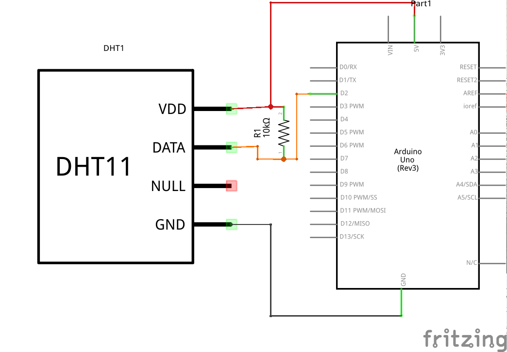

# Overview

# Features

# CO2 quality
[How co2 conentration impacts humans (in ukrainian)](https://docs.google.com/document/d/1l87kJx1lqZpuicVIvCt-TA4aJeTVuhVo9qCxow-L0lQ/edit?usp=sharing)

# Used electronic components

## Arduino Nano (or Funduino)

[The sketch to bind everything.](Firmwares/AirOk/AirOk.ino)

## Module TGS4161

  * [Library and desciption](https://github.com/solvek/CO2Sensor)

##  WiFi module ESP8266

 * [AliExpress](https://www.aliexpress.com/item/ESP8266-Serial-Wireless-WIFI-Module-Transceiver-Send-Receive-LWIP-AP-STA/32229052791.html?spm=2114.13010608.0.90.mKvlhC)
 * [Pinout](Images/esp8266/ESP8266-Serial-Wireless-WIFI-Module-Transceiver-Send--Receive-Module.jpg)
 * [Module details (incl AT commands)](https://www.itead.cc/wiki/ESP8266_Serial_WIFI_Module)
 * [Getting Started With the ESP8266 ESP-01](http://www.instructables.com/id/Getting-Started-With-the-ESP8266-ESP-01/?ALLSTEPS)
 * [Using ESP-01 and Arduino UNO](http://www.instructables.com/id/Using-ESP-01-and-Arduino-UNO/?ALLSTEPS)
 * Baud Rate: 115200

### Wires for ESP8266

 * URXD - Yellow
 * VCC - Red
 * GPIO0 - Brown
 * GPIO15 - Unwired
 * GPIO2 - Unwired
 * CH_PD - White
 * GND - Black
 * UTXD - Green

## Barometer/Temperature/Altitude sensor BMP180

Can measure pressure, temperature and altitude.

* [Library](https://github.com/sparkfun/BMP180_Breakout_Arduino_Library)
* i2c address: 0x77

## Temperature and humidity sensor DHT11

[DHT11 Library](https://github.com/adafruit/DHT-sensor-library)

## Screen GM009605

* [AliExpress](https://www.aliexpress.com/item/Free-shipping-1Pcs-128X64-Blue-OLED-LCD-LED-Display-Module-For-Arduino-0-96-I2C-IIC/32658340632.html?spm=2114.13010608.0.65.Ul6GyN)
* i2c address: 0x3c
* Protocol/Driver: SSD1306
* [Library](https://www.tindie.com/products/upgradeindustries/128x64-blue-i2c-oled-display-096-inch/)
  - ([github](https://github.com/olikraus/u8glib))
  - [User Reference](https://github.com/olikraus/u8glib/wiki/userreference)
* Input Voltage: 3-5 V

# Other libraries

  * [SimpleTimer](http://playground.arduino.cc/Code/SimpleTimer)
