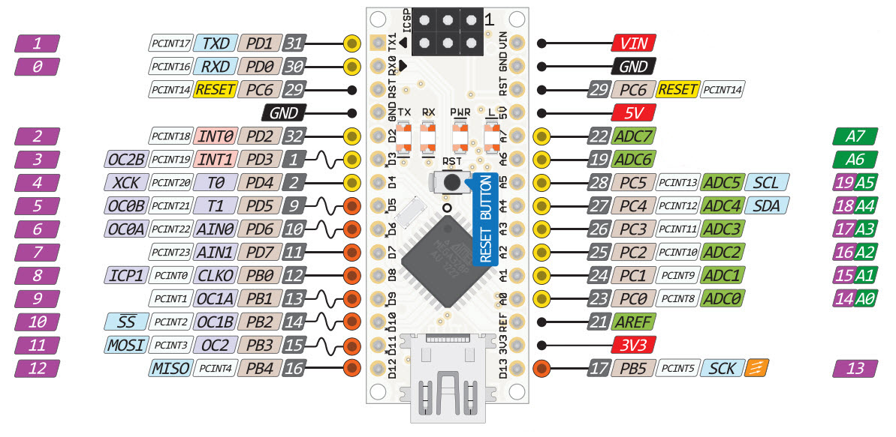
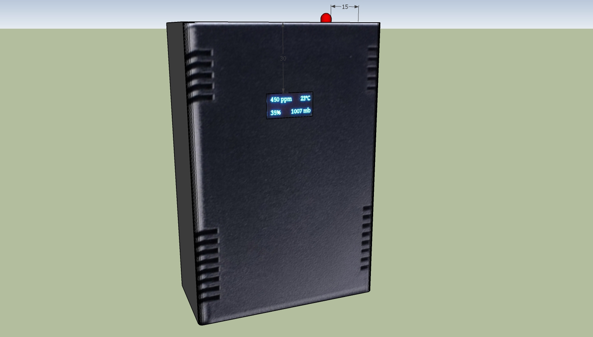

# Overview

An open sourse device which allows to control air condition in a room and publish data into cloud.

# Features

 * CO2 concentration reading
 * Temperature reading
 * Humidity reading
 * Pressure reading
 * Display to show the values
 * Sending data to cloud via wifi
 * Button for CO2 sensor calibration
 * Red indicator for critical CO2 level

# CO2 quality
[How co2 conentration impacts humans (in ukrainian)](https://docs.google.com/document/d/1l87kJx1lqZpuicVIvCt-TA4aJeTVuhVo9qCxow-L0lQ/edit?usp=sharing)

# Used electronic components

[Fritzing scheme](Docs/Airok.fzz)

## Arduino Nano (or Funduino)

 * [The sketch to bind everything.](Firmwares/AirOk/AirOk.ino)

 * Recommended input voltage: [7-12 V](https://www.arduino.cc/en/Main/ArduinoBoardNano)

## TGS4161 - CO2 Sensor

  * [Library and desciption](https://github.com/solvek/CO2Sensor)

  Module based on sensor MG811 also works fine for me however it is a little bit bigger and require 6V.

## Votage stabilizer 5V

L7805

## Votage stabilizer 3.3V

For screen, barometer and wifi module I supply 3.3V power. For regulation of voltage I am using ATC AP1084-33 voltage regulator with a radiator.

##  ESP8266 - WiFi module

 * [AliExpress](https://www.aliexpress.com/item/ESP8266-Serial-Wireless-WIFI-Module-Transceiver-Send-Receive-LWIP-AP-STA/32229052791.html?spm=2114.13010608.0.90.mKvlhC)
 * [Pinout](Images/ESP8266.jpg)
 * [Module details (incl AT commands)](https://www.itead.cc/wiki/ESP8266_Serial_WIFI_Module)
 * [Getting Started With the ESP8266 ESP-01](http://www.instructables.com/id/Getting-Started-With-the-ESP8266-ESP-01/?ALLSTEPS)
 * [Using ESP-01 and Arduino UNO](http://www.instructables.com/id/Using-ESP-01-and-Arduino-UNO/?ALLSTEPS)
 * Baud Rate: 115200

### Wires for ESP8266

In case you want to upgrade firmware connect GPIO0 to ground.

#### Top row

|GND|GPIO2|GPIO0|URXD|
|------|---------|--------|--------|
|GND|Unwired|Unwired|D7|
|Black|None|Brown|Green|

#### Bottom row

|UTXD|CH_PD|GPIO16|VCC|
|------|---------|--------|--------|
|D6|3v3|Unwired|3v3|
|Blue|Red|Non|Red|

## BMP180 - Barometer/Temperature/Altitude sensor

Can measure pressure, temperature and altitude.

* [Library](https://github.com/sparkfun/BMP180_Breakout_Arduino_Library)
* i2c address: 0x77

## DHT11- Temperature and humidity sensor

* [DHT11 Library](https://github.com/adafruit/DHT-sensor-library)
* Input voltage: [3-5V](https://www.adafruit.com/product/386)

## Oled Display

* [AliExpress](https://www.aliexpress.com/item/Free-shipping-1Pcs-128X64-Blue-OLED-LCD-LED-Display-Module-For-Arduino-0-96-I2C-IIC/32658340632.html?spm=2114.13010608.0.65.Ul6GyN)
* i2c address: 0x3c
* Protocol/Driver: SSD1306
* [Library](https://www.tindie.com/products/upgradeindustries/128x64-blue-i2c-oled-display-096-inch/)
  - [GitHub](https://github.com/olikraus/u8glib)
  - [User Reference](https://github.com/olikraus/u8glib/wiki/userreference)
  - [Fonts](https://github.com/olikraus/u8glib/wiki/fontgroup)
* Power: 3-5 V
* Resolution: 128*64
* Colors: Black and Blue
* Interface: I2C
* Screen Size: 0.96''

## TTP223 - Touch Button

  * Power: 2.5-5.5V
  * [AliExpress](https://www.aliexpress.com/item/10Pcs-TTP223-Touch-Key-Module-Self-Locking-No-Locking-Capacitive-Switches-Single-Road-Reconstruction-Module/32597879639.html?spm=2114.13010608.0.106.uBkkVb)

Trigger setting mode: (1- > Short ; 0- > No Short)

 * AB=00:No-lock High TTL level ouput;
 * AB=01:Self-lock High TTL level ouput;
 * AB=10:No-lock Low TTL level ouput;
 * AB=11:Self-lock Low TTL level ouput;

# Cloud Configuration

In order to configure wifi and cloud do the following.

 1. Make copy of `CloudSample.h` file naming it `Cloud.h` in the same directory (if you didn't do this yet)
 2. Uncomment the first line (`#define USE_CLOUD`)
 3. Register an account on [ThingSpeak](thingspeak.com) if you do not have yet
 4. Create a ThingSpeak channel
 5. Add 4 fields (CO2 concentration, Temperature, Pressure, Humidity)
 6. In section `API Keys` copy `Write API Key`
 7. Fill missing data in file `Cloud.h`

 ## Fields

|Field|Value|
|------|--------|
|field1|co2|
|field2|temperature|
|field3|pressure|
|field4|humidity|

## Uploading parameters to [OpenHAB](http://openhab.org) instead of ThingSpeak

The `CloudSample.h` file contains also an alternative example for configuration of uploadint data to OpenHAB server (it is commented). You can enable persisting data on OpenHAB server and view historical charts, for example usne [RRD database](https://github.com/openhab/openhab/wiki/rrd4j-Persistence).

Some my OpenHAB configuration examples with RRD persistance are available [here](https://github.com/solvek/electronics/tree/master/meteostation3)

Notice: Currently I am using OpenHAB 1. The examples may need to be adopted if you are using OpenHAB 2+.

# Electricity Power

## 12 V adapter

### With WiFi

 * Power: 3 W
 * Current: 240 mA

### Without WiFi

 * Power: 1.9 W
 * Current: 160 mA

# Enclosing into a box

 * [The box on AliExpress](https://www.aliexpress.com/item/Free-shipping-135-90-45mm-1-pcs-project-box-plastic-desk-top-electronic-enclosure-distribution-box/32685307900.html?spm=2114.13010608.0.0.EqeX6e)
 * Sizes: `135*90*45`
 * [Sketchup Model](Docs/Enclosing.skp)

## Wires

### Input power (9V)
|Main Board|External|Wire color|
|------|--------|--------|
|Ground|GND|Black|
|9V|VDD|Red|

### RGB Lamp

|Main Board|External|Wire color|
|------|--------|--------|
|Ground|GND|Black|
|D9|Red|Green|
|D11|Green|Green|
|D10|Blue|Green|

### DHT11 sensor

|Main Board|External|Wire color|
|------|--------|--------|
|Ground|GND|Black|
|5V|VDD|Red|
|D2|Data|Blue|

### Touch Button

|Main Board|External|Wire color|
|------|--------|--------|
|Ground|GND|Black|
|5V|VDD|Red|
|D3|Dat|Blue|

### TGS4161

|Main Board|External|Wire color|
|------|--------|--------|
|Ground|GND|Black|
|5V|VCC|Red|
|A0|AOUT|Blue|

### OLED Screen

|Main Board|External|Wire color|
|------|--------|--------|
|Ground|GND|Black|
|3V3|VDD|Red|
|A4|SDA|Blue|
|A5|SCK|Green|
