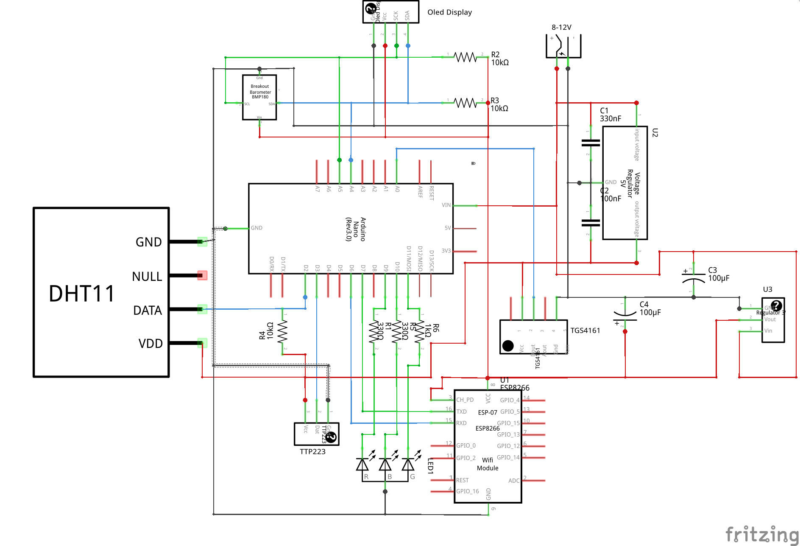

# Overview

An open sourse device which allows to control air condition in a room and publish data into cloud.

# Features

 * CO2 concentration reading
 * Temperature reading
 * Humidity reading
 * Pressure reading
 * Display to show the values
 * Sending data to cloud via wifi
 * Button for CO2 sensor calibration
 * Red indicator for critical CO2 level

# CO2 quality
[How co2 conentration impacts humans (in ukrainian)](https://docs.google.com/document/d/1l87kJx1lqZpuicVIvCt-TA4aJeTVuhVo9qCxow-L0lQ/edit?usp=sharing)

# Used electronic components

[Fritzing scheme](Docs/Airok.fzz)

## Arduino Nano (or Funduino)

 * [The sketch to bind everything.](Firmwares/AirOk/AirOk.ino)

 * Recommended input voltage: [7-12 V](https://www.arduino.cc/en/Main/ArduinoBoardNano)

## TGS4161 - CO2 Sensor

  * [Library and desciption](https://github.com/solvek/CO2Sensor)

  Module based on sensor MG811 also works fine for me however it is a little bit bigger and require 6V.

## Votage stabilizer

For voltage stabilizing for CO2 sensor I am using such votage stabilizator:

 * [AliExpress](https://www.aliexpress.com/item/LM7805-L7805-3-Terminals-Voltage-Stabilizer-Regulator-Power-Supply-7-5-35V-to-5V/32692400880.html?spm=2114.13010608.0.99.jZrgkR)
 * Input Power: 7.5-35V (input polarity is not important)
 * It is bases on L7805

##  ESP8266 - WiFi module

 * [AliExpress](https://www.aliexpress.com/item/ESP8266-Serial-Wireless-WIFI-Module-Transceiver-Send-Receive-LWIP-AP-STA/32229052791.html?spm=2114.13010608.0.90.mKvlhC)
 * [Pinout](Images/esp8266/ESP8266-Serial-Wireless-WIFI-Module-Transceiver-Send--Receive-Module.jpg)
 * [Module details (incl AT commands)](https://www.itead.cc/wiki/ESP8266_Serial_WIFI_Module)
 * [Getting Started With the ESP8266 ESP-01](http://www.instructables.com/id/Getting-Started-With-the-ESP8266-ESP-01/?ALLSTEPS)
 * [Using ESP-01 and Arduino UNO](http://www.instructables.com/id/Using-ESP-01-and-Arduino-UNO/?ALLSTEPS)
 * Baud Rate: 115200

### Wires for ESP8266

 * URXD - Yellow
 * VCC - Red
 * GPIO0 - Brown
 * GPIO15 - Unwired
 * GPIO2 - Unwired
 * CH_PD - White
 * GND - Black
 * UTXD - Green

## BMP180 - Barometer/Temperature/Altitude sensor

Can measure pressure, temperature and altitude.

* [Library](https://github.com/sparkfun/BMP180_Breakout_Arduino_Library)
* i2c address: 0x77

## DHT11- Temperature and humidity sensor

* [DHT11 Library](https://github.com/adafruit/DHT-sensor-library)
* Input voltage: [3-5V](https://www.adafruit.com/product/386)

## Oled Display

* [AliExpress](https://www.aliexpress.com/item/Free-shipping-1Pcs-128X64-Blue-OLED-LCD-LED-Display-Module-For-Arduino-0-96-I2C-IIC/32658340632.html?spm=2114.13010608.0.65.Ul6GyN)
* i2c address: 0x3c
* Protocol/Driver: SSD1306
* [Library](https://www.tindie.com/products/upgradeindustries/128x64-blue-i2c-oled-display-096-inch/)
  - [GitHub](https://github.com/olikraus/u8glib)
  - [User Reference](https://github.com/olikraus/u8glib/wiki/userreference)
  - [Fonts](https://github.com/olikraus/u8glib/wiki/fontgroup)
* Power: 3-5 V
* Resolution: 128*64
* Colors: Black and Blue
* Interface: I2C
* Screen Size: 0.96''

## TTP223 - Touch Button

  * Power: 2.5-5.5V
  * [AliExpress](https://www.aliexpress.com/item/10Pcs-TTP223-Touch-Key-Module-Self-Locking-No-Locking-Capacitive-Switches-Single-Road-Reconstruction-Module/32597879639.html?spm=2114.13010608.0.106.uBkkVb)

Trigger setting mode: (1- > Short ; 0- > No Short)

 * AB=00:No-lock High TTL level ouput;
 * AB=01:Self-lock High TTL level ouput;
 * AB=10:No-lock Low TTL level ouput;
 * AB=11:Self-lock Low TTL level ouput;

# Cloud Configuration

In order to configure wifi and cloud do the following.

 1. Make copy of `CloudSample.h` file naming it `Cloud.h` in the same directory (if you didn't do this yet)
 2. Uncomment the first line (`#define USE_CLOUD`)
 3. Register an account on [ThingSpeak](thingspeak.com) if you do not have yet
 4. Create a ThingSpeak channel
 5. Add 4 fields (CO2 concentration, Temperature, Pressure, Humidity)
 6. In section `API Keys` copy `Write API Key`
 7. Fill missing data in file `Cloud.h`

# Electricity Power

## 12 V adapter

### With WiFi

 * Power: 3 W
 * Current: 240 mA

### Without WiFi

 * Power: 1.9 W
 * Current: 160 mA
